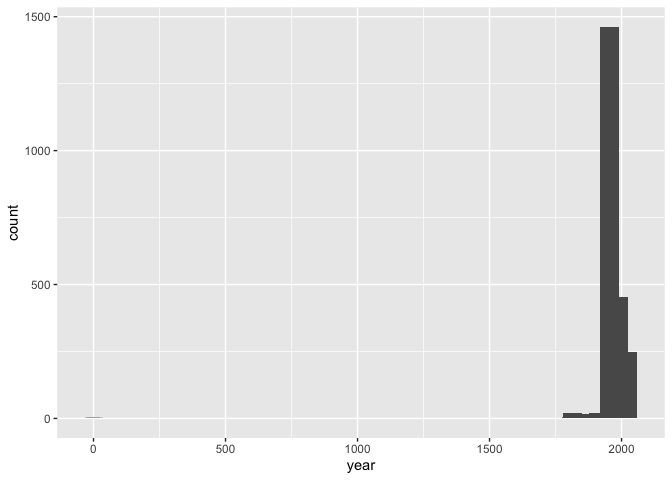
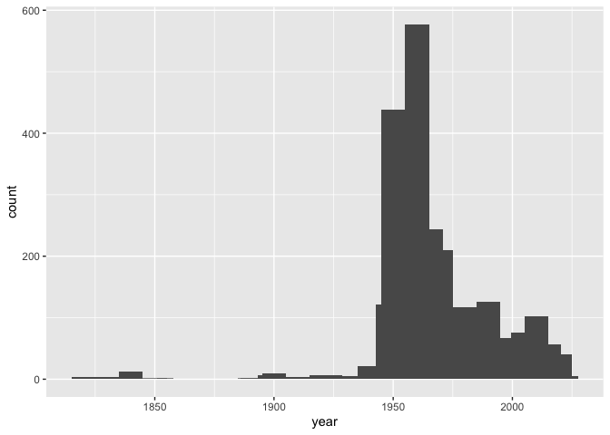

Lab 08 - University of Edinburgh Art Collection
================
Thomas Huang
2026-03-04

## Load Packages and Data

First, let’s load the necessary packages:

``` r
library(tidyverse) 
library(skimr)
```

Now, load the dataset. If your data isn’t ready yet, you can leave
`eval = FALSE` for now and update it when needed.

``` r
# Remove eval = FALSE or set it to TRUE once data is ready to be loaded
uoe_art <- read_csv("data/uoe-art.csv")
```

## Exercise 10

Let’s start working with the **title** column by separating the title
and the date:

``` r
uoe_art <- uoe_art %>%
  separate(title, into = c("title", "date"), sep = " \\(") %>%
  mutate(year = str_remove(date, "\\)") %>% as.numeric()) %>%
  select(title, artist, year, link) 
```

    ## Error:
    ## ! object 'uoe_art' not found

``` r
save(uoe_art, file = "uoe_art.RData")
```

    ## Error in `save()`:
    ## ! object 'uoe_art' not found

## Exercise 11

``` r
load("/Users/roberthuang/Desktop/Wake/Spring 2026/DSPsych/lab-08-uoe-art/uoe_art.RData")

skim(uoe_art) #108 pieces have artist info missing and 1,574 pieces have year info missing.
```

|                                                  |         |
|:-------------------------------------------------|:--------|
| Name                                             | uoe_art |
| Number of rows                                   | 3321    |
| Number of columns                                | 4       |
| \_\_\_\_\_\_\_\_\_\_\_\_\_\_\_\_\_\_\_\_\_\_\_   |         |
| Column type frequency:                           |         |
| character                                        | 3       |
| numeric                                          | 1       |
| \_\_\_\_\_\_\_\_\_\_\_\_\_\_\_\_\_\_\_\_\_\_\_\_ |         |
| Group variables                                  | None    |

Data summary

**Variable type: character**

| skim_variable | n_missing | complete_rate | min | max | empty | n_unique | whitespace |
|:--------------|----------:|--------------:|----:|----:|------:|---------:|-----------:|
| title         |         0 |          1.00 |   2 | 281 |     0 |     1597 |          0 |
| artist        |       108 |          0.97 |   2 |  55 |     0 |     1202 |          0 |
| link          |         0 |          1.00 |  57 |  60 |     0 |     3321 |          0 |

**Variable type: numeric**

| skim_variable | n_missing | complete_rate |    mean |    sd |  p0 |  p25 |  p50 |  p75 | p100 | hist  |
|:--------------|----------:|--------------:|--------:|------:|----:|-----:|-----:|-----:|-----:|:------|
| year          |      1574 |          0.53 | 1964.75 | 53.09 |   2 | 1953 | 1962 | 1978 | 2024 | ▁▁▁▁▇ |

## Exercise 12

Most pieces are somekind of modern. But one or a few pieces were from
around 0AD.

``` r
ggplot(uoe_art, aes(x = year)) +
  geom_histogram() +
  geom_histogram(binwidth = 50)
```

    ## `stat_bin()` using `bins = 30`. Pick better value `binwidth`.

    ## Warning: Removed 1574 rows containing non-finite outside the scale range (`stat_bin()`).
    ## Removed 1574 rows containing non-finite outside the scale range (`stat_bin()`).

<!-- -->

## Exercise 13

``` r
outlier <- uoe_art %>%
  filter(!is.na(year)) %>%
  filter(year <= 50) 

outlier #Something was wrong with the piece "Death Mask". This is the link to it: https://collections.ed.ac.uk/art/record/21649?highlight=death+mask. It was actually created in 1964. Something wrong with parsing.
```

    ## # A tibble: 1 × 4
    ##   title      artist        year link                                            
    ##   <chr>      <chr>        <dbl> <chr>                                           
    ## 1 Death Mask H. Dempshall     2 https://collections.ed.ac.uk/art/record/21649?h…

``` r
uoe_art <- uoe_art %>%
  mutate(year = if_else(year == 2, 1964, year))

ggplot(uoe_art, aes(x = year)) +
  geom_histogram() +
  geom_histogram(binwidth = 10)
```

    ## `stat_bin()` using `bins = 30`. Pick better value `binwidth`.

    ## Warning: Removed 1574 rows containing non-finite outside the scale range (`stat_bin()`).
    ## Removed 1574 rows containing non-finite outside the scale range (`stat_bin()`).

<!-- -->

## Exercise 14

``` r
artist_table <- table(uoe_art$artist) %>% 
  as.data.frame() %>% 
  arrange(desc(Freq))

head(artist_table) #Other than the mysterious "Unknown", the most commonly featured artist is Emma Gillies. I don't know Emma. Perhaps Emma went to the university.
```

    ##               Var1 Freq
    ## 1          Unknown  371
    ## 2     Emma Gillies  175
    ## 3       Ann F Ward   23
    ## 4     John Bellany   22
    ## 5 Zygmunt Bukowski   21
    ## 6      Boris Bućan   17

## Exercise 15

There are 11 pieces with “child” in their title.

``` r
child_in_title <- uoe_art %>% 
  filter(!is.na(title)) %>% 
  filter(str_detect(title, regex("child", ignore_case = TRUE)))

glimpse(child_in_title)
```

    ## Rows: 11
    ## Columns: 4
    ## $ title  <chr> "Untitled - Children Playing", "The Children's Hour", "Untitled…
    ## $ artist <chr> "Monika L I Uecker", "Eduardo Luigi Paolozzi KBE, RA", "William…
    ## $ year   <dbl> 1963, NA, NA, NA, NA, NA, 1938, NA, NA, NA, NA
    ## $ link   <chr> "https://collections.ed.ac.uk/art/record/99445?highlight=*:*", …
